# EinsatzWerk UI Reference

Status: approved product direction
Updated: 2026-07-17

## Purpose

The images in this directory are persistent product references for the visual
language, information architecture, and primary workflows of EinsatzWerk.

They define the intended direction, not a pixel-perfect implementation
specification. Real screens must preserve the workflow and information
hierarchy while remaining responsive, accessible, and technically feasible.

## Product north star

EinsatzWerk is not designed as an ERP home screen. It is the dispatcher's
workplace.

```text
An ERP opens with figures.
EinsatzWerk opens with the phone call and the customer.
```

Operational context comes before reporting:

- who is calling;
- whether the customer already exists;
- which asset needs service;
- what happened;
- when service is possible;
- what the dispatcher should do next.

Metrics support decisions in their own analysis workspace. They must not stand
between the dispatcher and the incoming call.

## Approved entry points

EinsatzWerk has no generic client Dashboard.

- Office users enter the application at `Anrufannahme`.
- Technicians enter the application at `Heute / Tagesplan`.
- Superadmins use the separate Filament application.
- Analytics is an explicit destination, not a landing page.
- A role without permission for `Anrufannahme` is redirected to its first
  permitted workspace.

Expected routes:

```text
/office                  -> /office/call-intake
/office/call-intake      -> Anrufannahme
/technician              -> /technician/today
/superadmin              -> Filament
```

## Visual direction

- Dark navy application chrome with a light, content-focused workspace.
- Orange is the primary action and active-navigation color.
- Blue, green, amber, red, and violet communicate status, but color must never
  be the only status indicator.
- Dense desktop layouts are intentional for dispatchers and office staff.
- Cards and split panes should keep related information visible without
  forcing users through a chain of pages.
- German is the primary UI language.
- Global search is always prominent in the office layout.
- Metronic is the UI foundation; reusable application components are extracted
  incrementally from real screens.

## How Metronic is used

Metronic is a source of UI building blocks, not a source of product workflows.
Its ready-made Dashboard pages do not define EinsatzWerk.

The application primarily uses and adapts:

- tables;
- forms and validation states;
- cards;
- search and command UI;
- drawers;
- dialogs;
- tabs;
- timelines;
- notifications;
- navigation and layout primitives.

Product screens are composed around the service-company workflow. A Metronic
page may inspire styling or interaction details, but it is never copied as a
business design without validating the workflow.

## Reference screens

### Brand

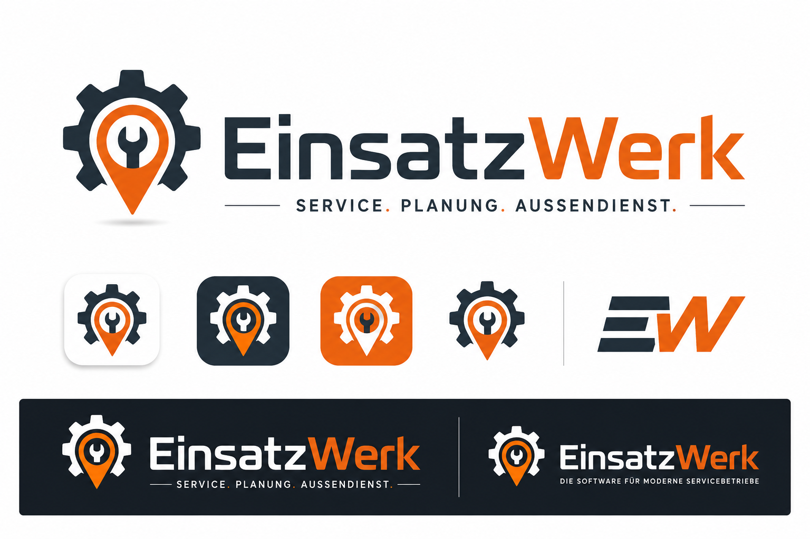

The displayed brand is `EinsatzWerk`; the public domain may be
`Einsatz-Werk.de`.

### Technician workspace

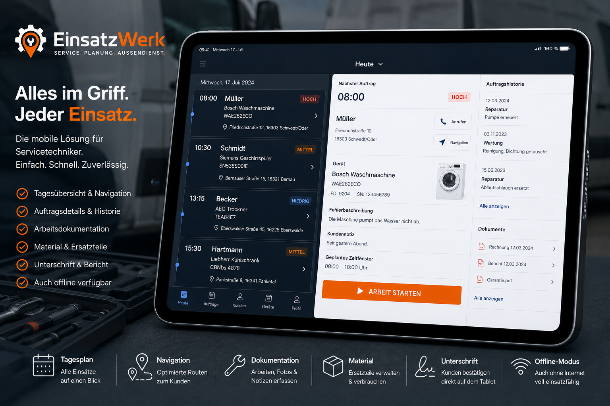

Core logic:

- today's ordered visits;
- next visit and customer contact actions;
- asset and service-history context;
- explicit visit lifecycle action;
- documentation, materials, signature, and synchronization state.

The image shows the preferred tablet workspace. A phone layout must become a
single-column task flow and must not simply shrink these three columns.

### Technician tour — tablet

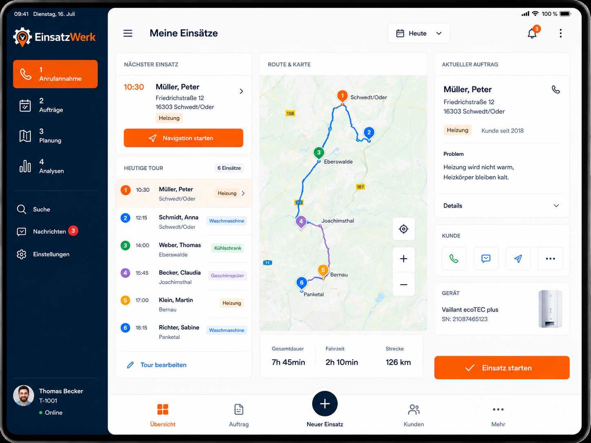

The tablet tour combines the ordered stops, route map, selected visit, customer
contact, and the action that starts work.

### Technician tour — phone

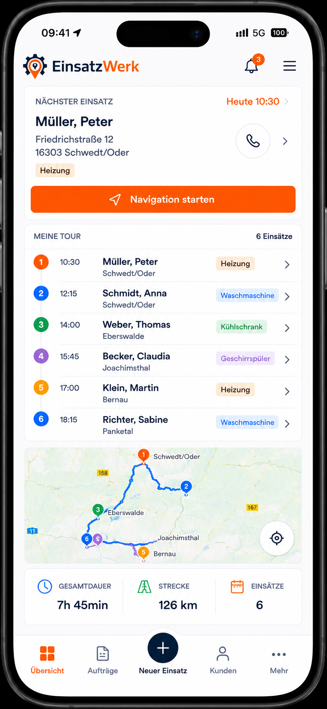

The phone view prioritizes the next visit, the ordered tour, navigation, and
route totals. It is the technician's default entry point.

### Technician navigation

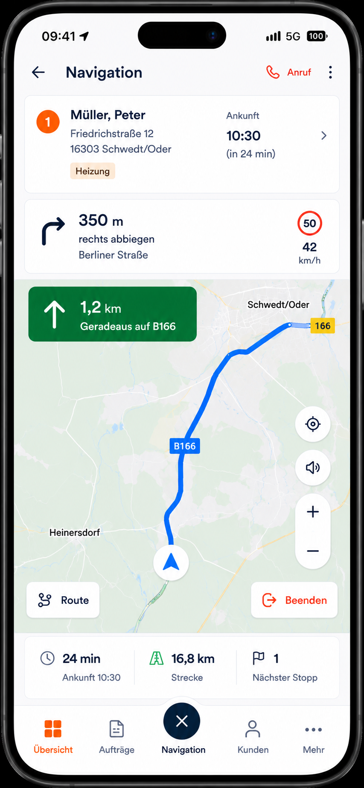

This defines the navigation experience and information hierarchy. Routing and
turn guidance must come from an external map/navigation provider or SDK;
EinsatzWerk does not implement its own road-routing engine.

### Technician at the customer

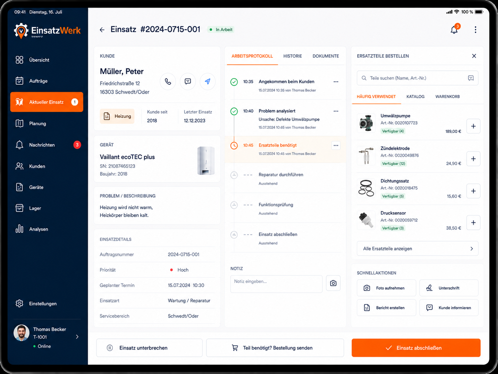

The tablet becomes the work surface at the customer:

- customer, asset, problem, and visit context;
- chronological work protocol;
- diagnosis and notes;
- part search and part request;
- photos, signature, report, and customer communication;
- pause and complete actions.

### Completed technician visit

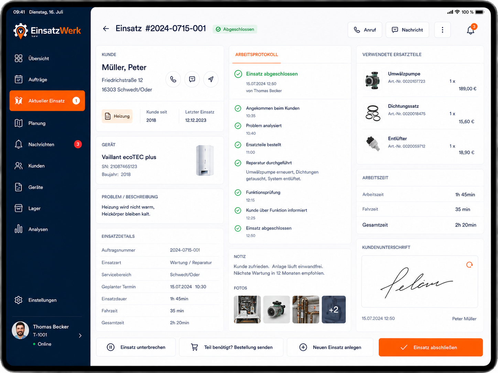

Completion shows the immutable service record: event timeline, work performed,
parts, time, photos, notes, and customer signature. Reopening requires a
permission and a recorded reason.

### Orders

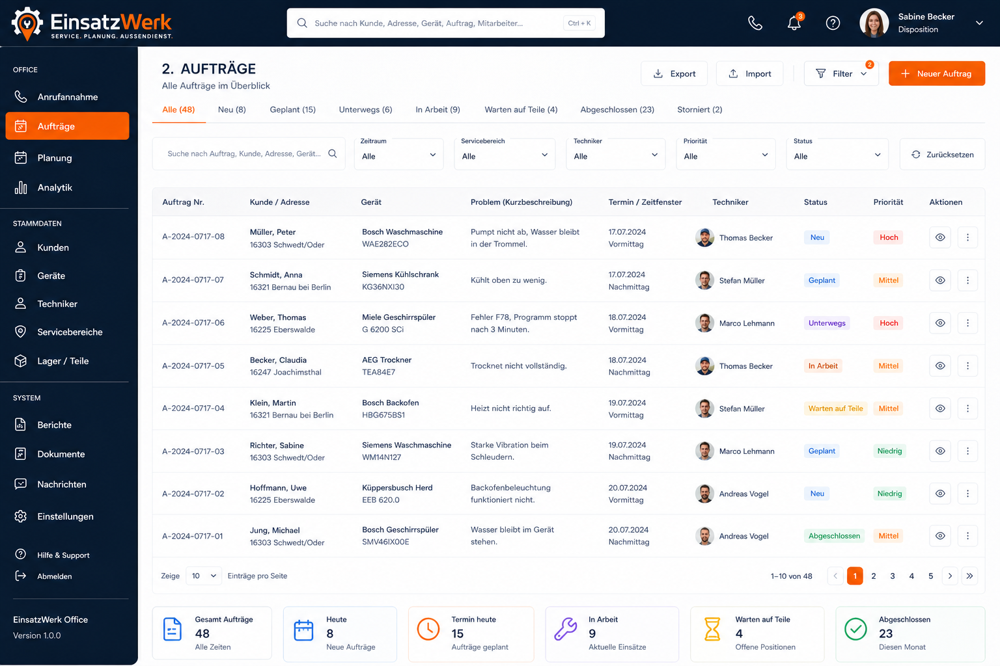

Core logic:

- status-based working views;
- fast filtering and global search;
- customer, asset, appointment, technician, status, and priority visible in
  one row;
- saved filters may be added later;
- status labels reflect stable internal state codes.

### Call intake

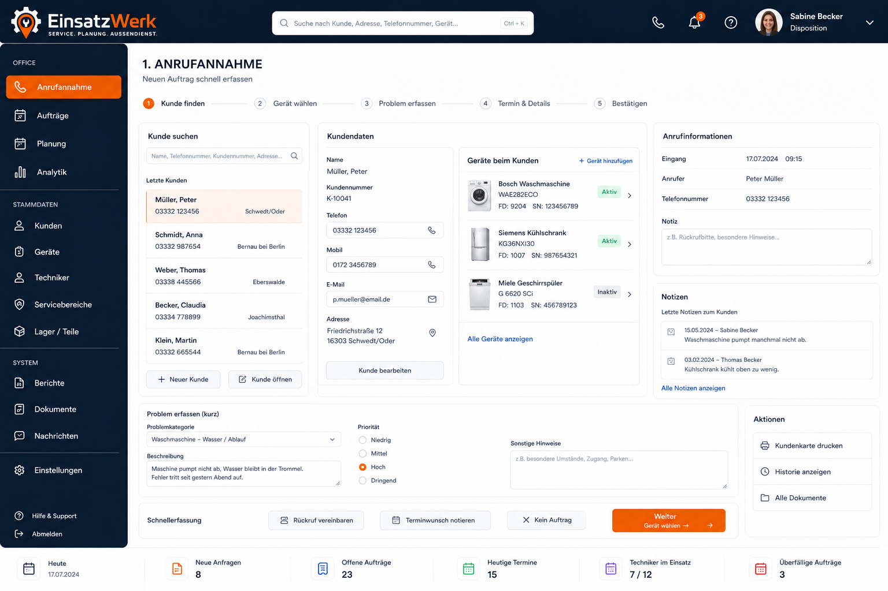

This is the primary office landing page and the first implementation vertical
slice.

Target workflow:

1. Find or create a customer.
2. Select or create an asset.
3. Capture the problem.
4. Capture appointment constraints and details.
5. Confirm and create the service order.

Acceptance target: a trained dispatcher creates a normal service order in
60–90 seconds without navigating through unrelated pages.

Search must support customer number, legacy number, name, company, normalized
phone, address, postal code, order number, serial number, model, and
manufacturer.

### Planning and dispatch

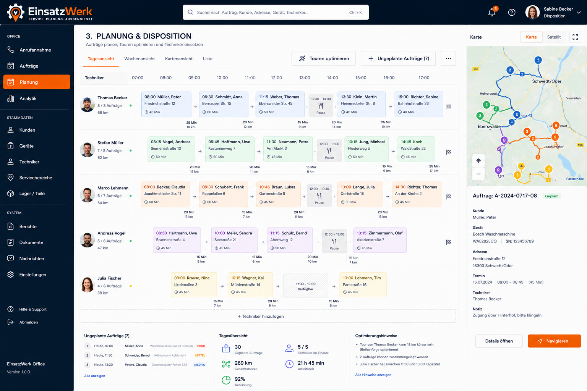

Core logic:

- technicians as planning lanes;
- visits and non-visit stops on a timeline;
- travel time and distance between stops;
- unplanned work queue;
- map and selected-order context;
- drag-and-drop with conflict feedback;
- locked stops that route optimization may not move;
- hard constraints and soft preferences shown differently;
- `Tour vorschlagen` produces a proposal that the dispatcher accepts,
  modifies, or rejects.

The route assistant supports the dispatcher; it never silently replaces a
manually approved tour.

### Analytics and reports

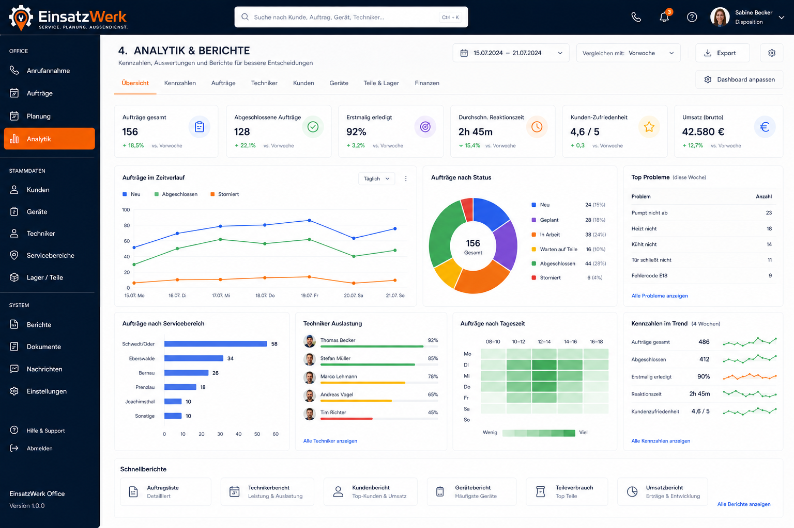

This is not a landing Dashboard. It is a separate analysis workspace.

Every KPI must have a documented definition, source, date basis, timezone, and
permission scope. Financial metrics are hidden until their source data is
reliable.

### Customer master data

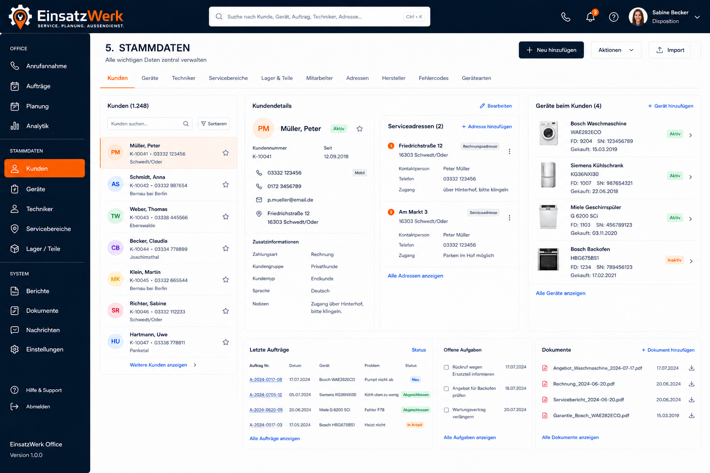

Core logic:

- customer search and selection;
- customer details, contacts, and service locations;
- installed assets;
- recent orders, open tasks, and documents;
- context stays visible while the user examines related records.

The legacy-data analysis must decide whether a separate `service_locations`
entity is required for payer, owner, tenant, and service-address scenarios.

### Technicians

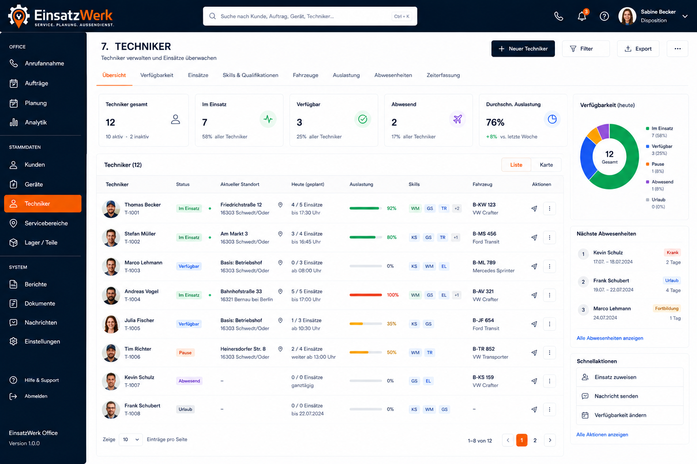

Core logic:

- current operational state;
- availability and absences;
- skills and qualifications;
- assigned vehicle;
- current or last known work location;
- planned workload and capacity;
- quick navigation to the technician's day plan.

Location must clearly distinguish a planned service location from live GPS.
Live tracking requires a separate privacy and retention decision.

## Interaction rules

- Primary actions are explicit and use verbs.
- Destructive and irreversible actions require confirmation.
- Server-side business rules remain authoritative.
- Drag-and-drop is a command, not a cosmetic rearrangement; the server validates
  availability, concurrency, constraints, and permissions.
- Critical edits use versioning or locking to prevent silent overwrites.
- Long operations show progress and can be safely retried.
- Route optimization results and warnings are stored as an auditable proposal.
- Offline technician commands use unique client operation IDs.
- Synchronization state is visible: saved locally, uploading, synchronized, or
  needs attention.
- Offline conflicts are resolved by explicit domain rules, never by blind
  last-write-wins behavior.

## Responsive and accessibility constraints

- Office and dispatch workspaces are desktop-oriented.
- Technician screens support tablet and phone layouts.
- Keyboard navigation is required for call intake, global search, orders, and
  planning.
- Controls have readable labels and useful focus states.
- Status is communicated with text/icon as well as color.
- Minimum touch targets and contrast are validated during implementation.
- Map-only information must also be available in a textual form.
